# 🌐 Feature-Rich Business & Personal Branding Portfolio

A **premium, modern, interactive portfolio website** designed for professionals, digital marketers, LinkedIn coaches, freelancers, and business owners who want to enhance their **visibility, credibility, and online presence**.

---

## 📑 Table of Contents

- <a href="#project-overview">🚀 Project Overview</a>
- <a href="#vision-purpose">🎯 Vision & Purpose</a>
- <a href="#target-audience">👥 Target Audience</a>
- <a href="#website-structure-storytelling-flow">🧩 Website Structure & Storytelling Flow</a>
- <a href="#hero-section-first-impression-matters">✨ Hero Section – First Impression Matters</a>
- <a href="#glassmorphism-navigation-experience">🧊 Glassmorphism Navigation Experience</a>
- <a href="#about-me-professional-not-boring">👤 About Me – Professional, Not Boring</a>
- <a href="#skills-work-section-visual-strength-display">🛠️ Skills & Work Section – Visual Strength Display</a>
- <a href="#advanced-card-hover-interactions">🎴 Advanced Card & Hover Interactions</a>
- <a href="#button-interaction-design">🔘 Button & Interaction Design</a>
- <a href="#css-features–interactive-modern-futuristic">🎨 CSS Features – Interactive, Modern & Futuristic</a>
- <a href="#ui-ux-design">🎨 UI / UX Approach</a>
- <a href="#javascript-features–modern-interactivity-dynamic-ux">⚡JavaScript Features Modern Interactivity & Dynamic UX</a>
- <a href="#tools-technologies-used">🧰 Tools & Technologies Used</a>
- <a href="#smart-contact-section">📞 Smart Contact Section</a>
- <a href="#business-problems-solved">📌 Business Problems Solved</a>
- <a href="#future-enhancements">🔮 Roadmap & Future Expansion</a>
- <a href="#final-impression">🌙 Final Impression</a>
- <a href="#read-me">📦 README Highlights</a>
- <a href="#connect-with-me">📬 Connect with Me</a>
- <a href="#project-visuals">🖼️ Project Visuals</a>

---

## 🚀 Project Overview  

This project is a **modern, interactive, and visually-rich personal branding and business portfolio website**. It is designed for professionals, digital marketers, LinkedIn coaches, freelancers, and businesses seeking to enhance their **visibility, credibility, and online presence**.

`The portfolio leverages the latest **HTML5, CSS3, JavaScript, SVG graphics, animations, and responsive design techniques** to create a **dynamic storytelling experience** that keeps visitors engaged.`

| Property     | Details |
|-------------|----------|
| **Type**     | Personal Branding Portfolio |
| **Category** | Digital Presence Website |
| **Design**   | Glassmorphism + Modern UI |
| **Tech Stack** | HTML5 \| CSS3 \| JavaScript |
| **Responsive** | Fully Mobile Optimized |

---

## 🔑 Key Highlights

- ✨ Interactive hero section with typing and glowing text effects.  
- 🧊 Glassmorphic navigation bars and cards.  
- 🧩 Puzzle-style and stack-style skill display sections.  
- 🎬 Scroll-based animations with reveal effects.  
- 🌗 Dark/Light mode toggle for modern aesthetics.  
- 📱 Mobile-first, responsive design.
- ✨ Interactive UI Components  
- 🎯 Story-Driven Content Flow  
- 🎨 Glassmorphism Design System  
- ⚡ Scroll-Triggered Animations  
- 🧠 Dynamic JavaScript Features  
- 📱 Fully Responsive Grid Layout

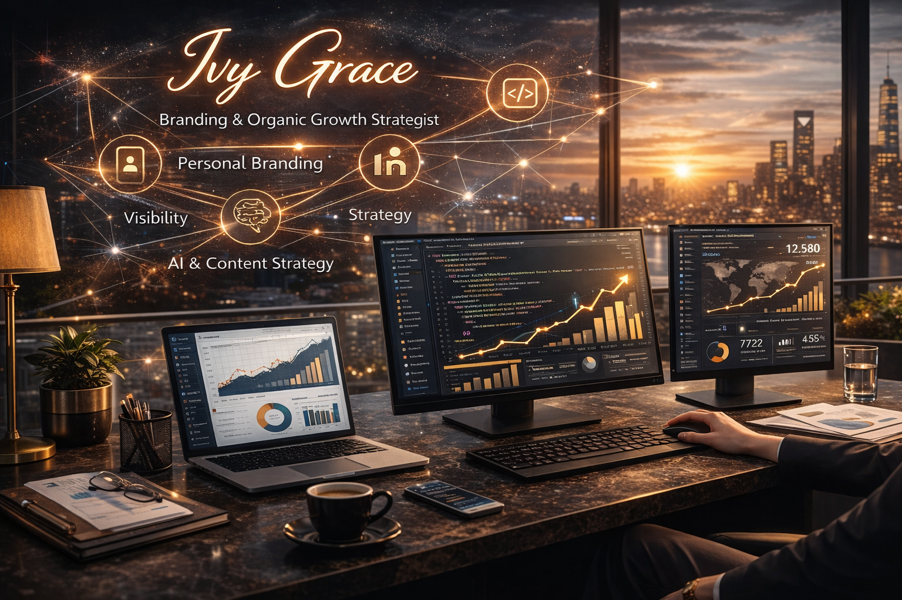

---

## 🎯 Vision & Purpose

`This portfolio is strategically crafted to **highlight skills, accomplishments, and professional services through an engaging and interactive digital experience.**`

- 🚀 Amplify personal branding and strengthen LinkedIn visibility.  
- 🏅 Showcase achievements to reinforce professional credibility.  
- 💼 Present digital marketing and consulting services with clarity and authority.  
- 🤝 Build trust through testimonials, case studies, and proven results.  
- 🎨 Create immersive storytelling that keeps visitors actively engaged.  
- 🌐 Develop a strong, memorable, and impactful digital identity.  
- 📊 Structure offerings professionally for both B2B and B2C audiences.  
- 📩 Encourage smooth and direct communication opportunities.  
- 🧠 Establish long-term personal brand authority and thought leadership.  

`This portfolio is **not a static presentation — it is a premium, dynamic, and strategically structured digital presence designed to leave a lasting impression.**`

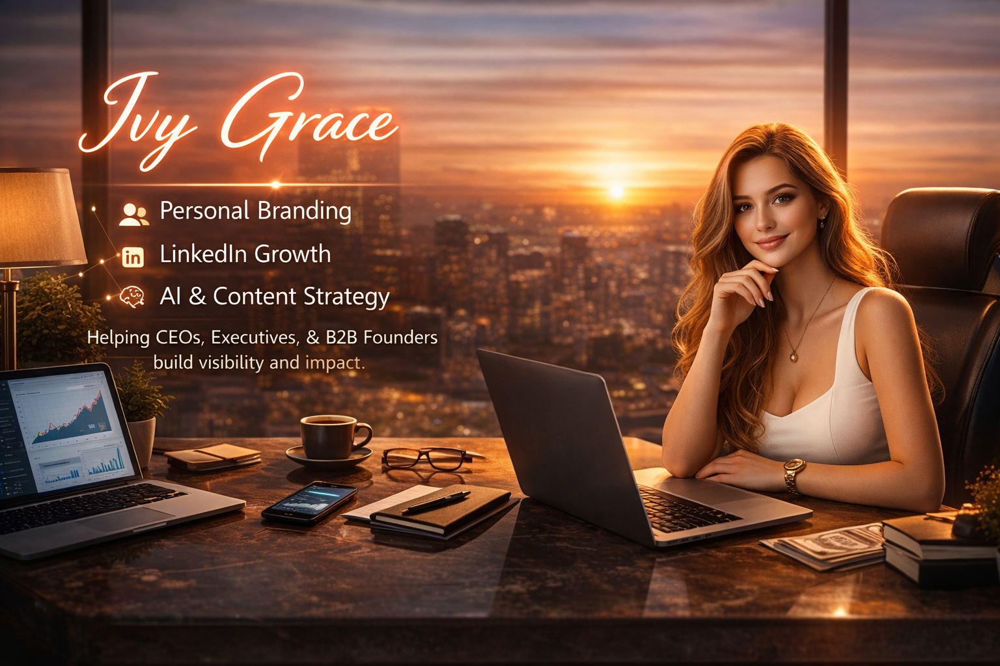

---
 
## 👥 Target Audience

`This portfolio is tailored for professionals and growth-driven individuals who value visibility, credibility, and strategic positioning.`

### 🎯 Ideal Audience Segments

- 🔹 LinkedIn professionals aiming to strengthen their personal brand presence.  
- 🔹 Industry thought leaders building authority and influence online.  
- 🔹 Branding and marketing strategists showcasing expertise and results.  
- 🔹 Startup founders establishing a strong and credible digital identity.  
- 🔹 Digital creators expanding their professional portfolio reach.  
- 🔹 Coaches and mentors highlighting their impact and success stories.  
- 🔹 Consultants and freelancers presenting structured service offerings.  
- 🔹 Business owners seeking a polished and trustworthy online presence.  

`This portfolio speaks to individuals who understand that **visibility + credibility = opportunity.**`

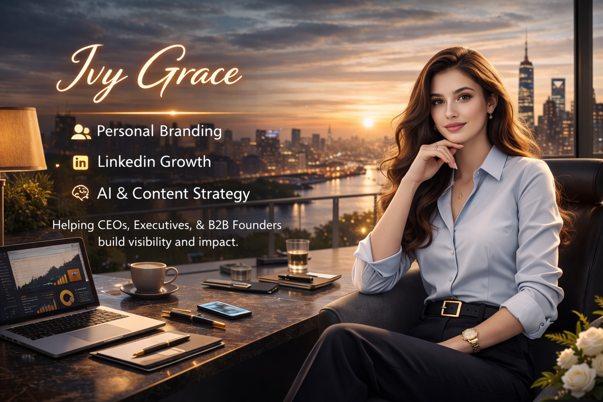

---

## 🧩 Website Architecture & Storytelling Flow

## 📖 Strategic Storytelling Framework

The website is thoughtfully structured to guide visitors through a seamless journey:

**Identity → Expertise → Proof of Work → Credibility → Connection**

`Each section builds upon the previous one, creating a smooth and engaging narrative experience.`

## 📋 Complete Section Breakdown

| Section | Core Elements | Strategic Purpose |
|----------|--------------|------------------|
| Navigation Bar | Logo, responsive menu, hamburger icon, smooth scroll | Effortless navigation & premium UX |
| Hero Section | Dynamic headline, typing animation, CTA buttons | Powerful first impression |
| About Me | Personal journey, positioning statement, profile image | Emotional & professional connection |
| Skills Showcase | Interactive skill blocks, hover effects, motion elements | Competency visualization |
| Services / Works | Structured service cards, strategy highlights | Clear value proposition |
| Projects & Experience | Timeline layout, animated reveal cards | Demonstrate real-world expertise |
| Achievements | Certifications, milestones, recognitions | Authority reinforcement |
| Testimonials | Client feedback, trust indicators | Social proof & credibility |
| Visual Gallery / Memories | Lifestyle images, creative snapshots | Humanized branding |
| Mindset / Philosophy | Leadership beliefs, growth mindset | Inspirational positioning |
| Contact Section | Email CTA, LinkedIn link, call option, interactive buttons | Direct engagement pathway |
| Footer | Organized links, quick navigation, minimal design | Professional closure |

This structure ensures the website is not just informative —  
it delivers a **premium, interactive, and strategically layered digital experience.**

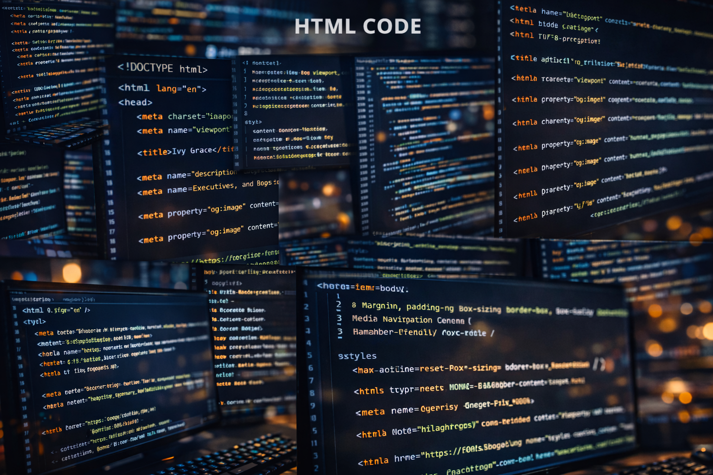

---

## ✨ Hero Section – First Impression Matters  

`The **Hero Section** is crafted to immediately capture attention and communicate clarity, confidence, and authority.`

### 🚀 Key Highlights

- ⌨️ Animated typing effect showcasing core expertise (e.g., Personal Branding, LinkedIn Strategy, Content Marketing).  
- 🌟 Bold, glowing headline typography with modern gradient styling.  
- 🔄 Smooth text transitions for dynamic visual engagement.  
- 🎯 Strong call-to-action button (LinkedIn / Connect Now).  
- 📜 Scroll-triggered animations that enhance storytelling flow.  
- 📉 Subtle hero resize/shrink effect on scroll for a premium interactive feel.  

`This section delivers a **powerful, energetic, and memorable first impression** that instantly positions the brand with authority.`

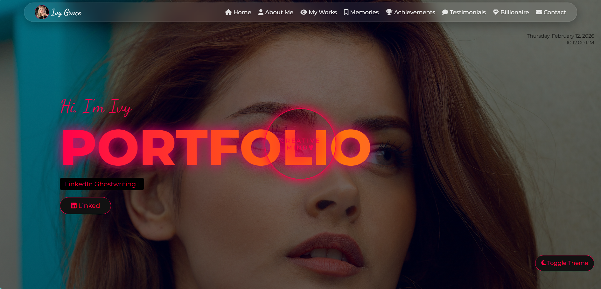

---

## 🧊 Glassmorphism Navigation Experience  

**Properties & Features:**

- Semi-transparent backgrounds with **rgba**.  
- Frosted blur using **backdrop-filter**.  
- Rounded corners, soft shadows, and smooth hover effects.  
- Mobile-friendly hamburger menu with fade-in animation.

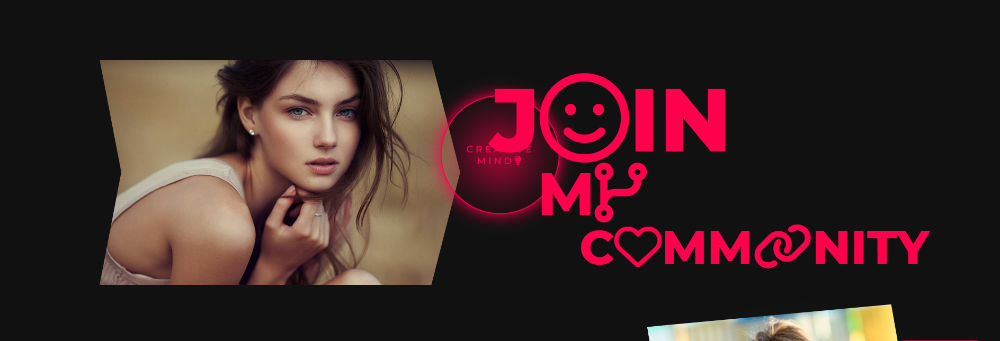

**Purpose:** Modern, interactive navigation that elevates the overall UX.

- Two-column layout: Image + description.  
- Elegant typography with Playfair Display and italics.  
- Responsive design with flex-wrap for smaller screens.  
- Rounded corners for images and cards.

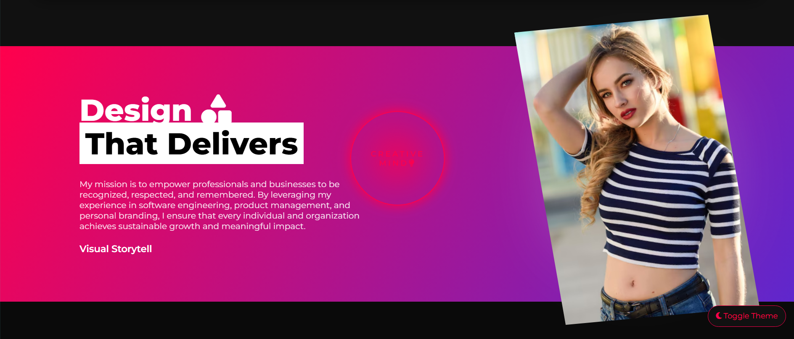

---

## 🛠️ Skills & Work Section – Visual Strength Display  

- Puzzle/stack-style skill representation.  
- Large fonts with hover rotations and translations.  
- Mobile-responsive with media queries.  
- Integrates with dark/light mode toggle.
  
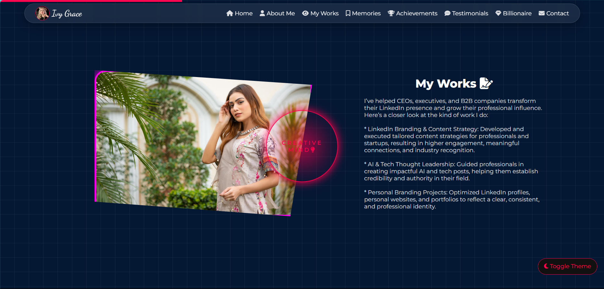

---

## 🎴 Advanced Card & Hover Interactions  

- Cards and boxes with scale transform and colored shadows.  
- Smooth hover animations to engage users visually.  
- Cards highlight services, testimonials, and project previews.

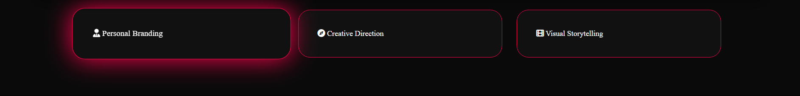
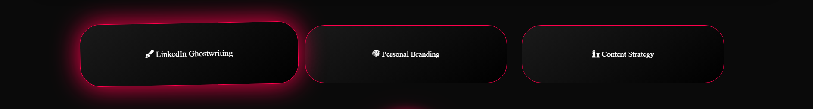
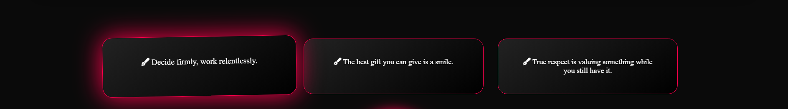

---

## 🔘 Button & Interaction Design  

- Buttons with hover color transitions, scaling, and shadow effects.  
- Dark/Light mode compatible.  
- Mobile-friendly sizing for better accessibility.

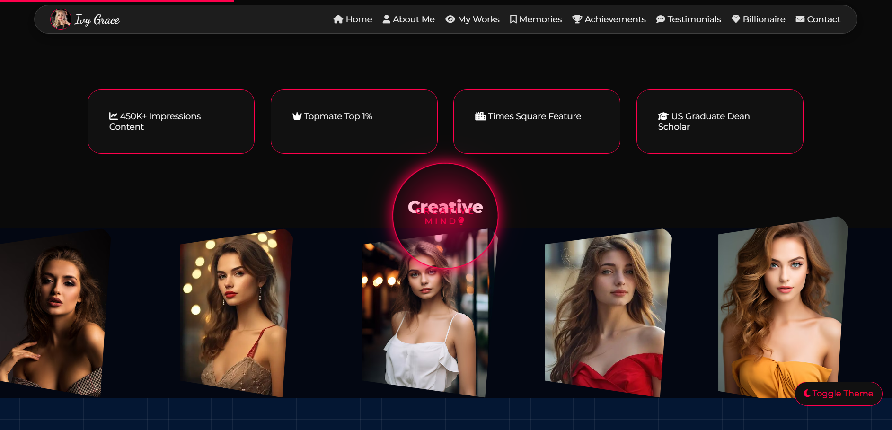

---

# 🔁 Strategic Storytelling Flow & Navigation Experience

## 📖 Guided Visitor Journey

The website follows a structured and intentional storytelling path designed to build connection and credibility step by step:

`Introduction 
↓ 
Brand Story 
↓ 
Work & Services 
↓ 
Achievements
↓ 
Testimonials
↓ 
Vision & Mindset 
↓ 
Contact & Engagement`

This natural progression moves visitors smoothly from  
**Awareness → Interest → Trust → Engagement → Action**

Each section strategically strengthens the brand narrative while guiding users toward meaningful interaction.

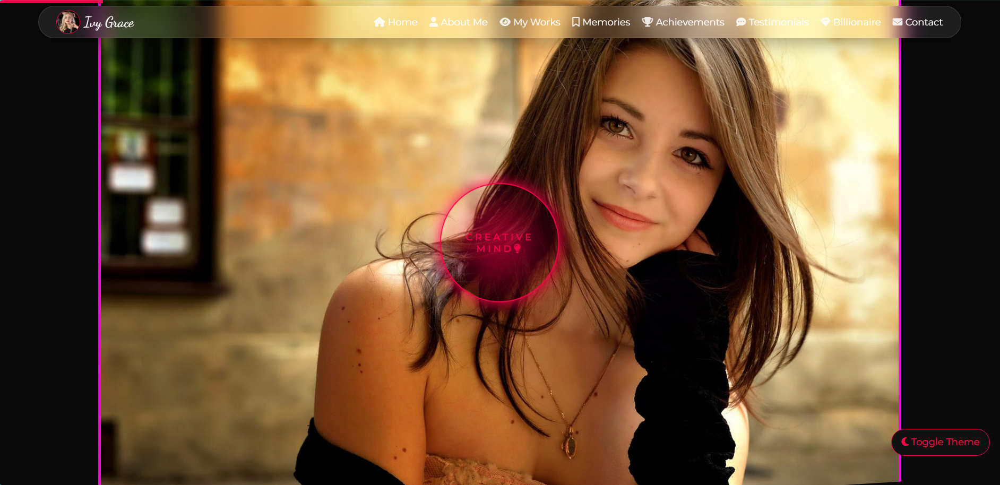

---

### 🧭 Navigation System – Seamless & Modern

To support this storytelling flow, the navigation system is designed for clarity, accessibility, and premium user experience.

### ✨ Navigation Features

- 🧊 Fixed glassmorphic navbar for a modern aesthetic  
- 🔗 Smooth-scroll anchor navigation between sections  
- 📱 Responsive mobile hamburger menu  
- 📊 Scroll progress indicator for visual journey tracking  
- 🕒 Live date & time display for dynamic interaction  

**Purpose:**  

Deliver frictionless navigation while maintaining a sleek, interactive, and professionally structured browsing experience.

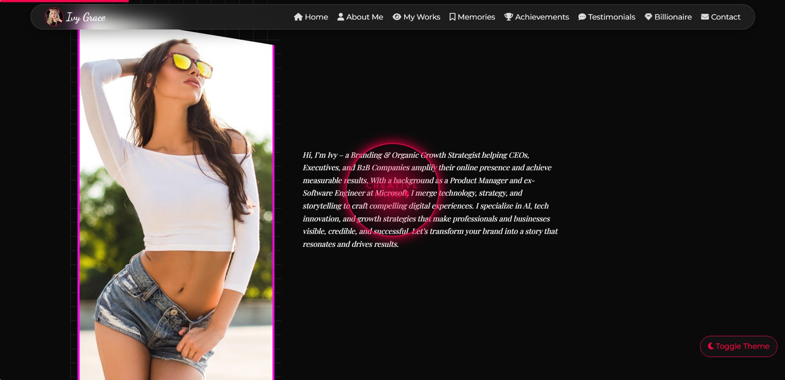

---

## 🎨 CSS Features – Advanced, Immersive & Future-Ready  

The CSS architecture of this portfolio is carefully engineered to deliver a **premium, interactive, and performance-optimized experience**.  
It combines modern UI trends, motion design principles, and responsive layout systems to ensure the website feels alive, engaging, and strategically structured.

Rather than relying on heavy frameworks, the design leverages pure CSS techniques to create depth, movement, and clarity — balancing **visual sophistication with usability**.

---

## ✨ Core Design Systems & Interactive Enhancements

| Feature | Implementation Approach | UX & Strategic Impact | Applied Areas |
|----------|------------------------|------------------------|----------------|
| **Glassmorphism UI** | Semi-transparent layers, `backdrop-filter: blur()`, soft borders, subtle shadows | Creates layered depth, premium feel, and modern interface hierarchy | Navbar, Cards, Section Containers |
| **Gradient Typography & Accents** | Linear & multi-tone gradients on headings and highlights | Strengthens brand vibrancy and visual appeal | Hero Titles, Section Headers |
| **Advanced Hover Micro-Interactions** | `transform`, `transition`, scale, elevation, shadow dynamics | Enhances interactivity and provides tactile digital feedback | Buttons, Cards, Skill Blocks |
| **Scroll-Based Reveal Effects** | Opacity + translate animations triggered on viewport entry | Guides user focus and supports storytelling progression | Content Sections, Timeline, Cards |
| **CSS Keyframe Animations** | Custom `@keyframes` for glow, pulse, slide-in, floating elements | Adds motion energy without overwhelming the layout | Hero Area, Highlights, Icons |
| **Clip-Path & Shape Styling** | Polygonal and organic shapes via `clip-path` | Creates distinctive layouts without extra assets | Image Frames, Decorative Sections |
| **Responsive Grid Architecture** | CSS Grid with `auto-fit`, `minmax()` | Adaptive layouts across devices and resolutions | Projects, Services, Skills |
| **Flexbox Layout System** | Flexible alignment and spacing control | Clean content structuring and vertical rhythm | Navigation, Cards, Containers |
| **Theme Toggle (Dark/Light Mode)** | Class-based theme switching | Improves accessibility, personalization, and comfort | Entire Website |
| **Scroll Progress Indicator** | Fixed top bar reflecting scroll percentage | Provides navigation awareness and completion feedback | Global Layout |
| **Pseudo-Elements for UI Detailing** | `::before` and `::after` for visual accents | Adds polish without increasing HTML complexity | Buttons, Underlines, Cards |
| **Image Interaction Effects** | Smooth scaling, subtle rotation, depth shadows | Adds dimension and premium visual engagement | Hero Image, Project Previews |
| **Smooth Scrolling & Motion Timing** | `scroll-behavior: smooth` + cubic-bezier transitions | Creates fluid navigation and refined motion experience | Whole Interface |

---

## 💡 Design & Development Philosophy***

This portfolio is built on a foundation where **design, interaction, and performance work together seamlessly**.  
Every styling and scripting decision is intentional — focused on clarity, engagement, and long-term scalability.

***🎯 Core Design Principles***

- **Clarity Over Complexity** – Animations and effects are purposeful, not decorative noise.  
- **Meaningful Motion** – Transitions and reveals enhance storytelling and guide attention.  
- **Visual Precision** – Balanced spacing, structured grids, and controlled color systems ensure harmony.  
- **User-First Experience** – Accessibility, responsiveness, and intuitive interaction remain top priority.  

---

## 🎨 UI / UX Approach  

The interface is designed to feel effortless and refined:

- 🧼 Clean, eye-friendly layout structure.  
- 📐 Consistent spacing and alignment for visual balance.  
- 🚫 No clutter or unnecessary visual overload.  
- 🌊 Fluid scrolling and smooth interaction flow.  
- 📱 Fully responsive behavior across devices.  

---

## 🧠 Developer Perspective

The integration of **CSS and JavaScript features** creates a cohesive, immersive digital experience:

- ⚡ A powerful and engaging first impression.  
- 🎬 Smooth animations that naturally direct user focus.  
- 🖱️ Interactive components encouraging exploration.  
- 🎨 Modern UI patterns (glassmorphism, gradients, dynamic layouts) ensuring aesthetic excellence.  
- 🔄 Real-time elements (typing effects, scroll indicators, dynamic date/year updates) making the interface feel alive and evolving.

Every design and development choice reinforces **clarity, elegance, professionalism, and modern digital identity.**

---

## ⚡ JavaScript Features – Dynamic & Intelligent Interaction 

JavaScript enhances the portfolio by adding movement, personalization, and real-time interactivity.

| Feature | Functionality | Implementation Area |
|----------|--------------|---------------------|
| **Typing Animation** | Simulates auto-typing effect for dynamic keywords | Hero Section |
| **Morphing Text Effect** | Rotates or transitions between multiple professional phrases | Hero Headlines |
| **Scroll Progress Indicator** | Updates width based on scroll percentage | Header / Top Bar |
| **Theme Toggle System** | Switches between dark and light modes dynamically | Global Layout |
| **LocalStorage Integration** | Stores theme preference and user settings | Entire Website |
| **Responsive Hamburger Menu** | Toggles mobile navigation visibility | Navbar |
| **Scroll Reveal Animations** | Detects viewport entry and activates animations | All Sections |
| **Smooth Scroll Behavior** | Enables fluid navigation between anchor links | Navigation System |
| **Dynamic Year / Date Updates** | Auto-updates footer year and live time display | Footer / Navbar |

## 🚀 Technical Impact

The integration of these technologies ensures:

- ⚡ High performance with lightweight scripting  
- 🎯 Structured and semantic development  
- 🎨 Visually immersive UI with interactive elements  
- 📱 Fully responsive cross-device compatibility  
- 🔄 A living, dynamic user experience  

Together, these tools and features transform the portfolio into a **modern, scalable, and technically refined digital platform.**

---

## 🧰 Tools & Technologies Used 

This portfolio is developed using modern web technologies focused on performance, interactivity, and scalability.

| Technology | Role & Implementation |
|------------|----------------------|
| **HTML5** | Provides semantic structure, accessibility, and SEO-friendly markup. |
| **CSS3** | Powers advanced styling including animations, gradients, glassmorphism, clip-path shapes, and responsive layouts. |
| **JavaScript (Vanilla JS)** | Handles dynamic behavior, interactivity, animations, and DOM manipulation. |
| **SVG & Icon Systems** | Scalable vector visuals, decorative dividers, and interactive UI elements. |
| **VS Code** | Primary development environment for structured coding and debugging. |
| **Git & GitHub** | Version control, project management, and deployment hosting. |
| **ChatGPT** | Assisted with structured content strategy, UI logic planning, and documentation refinement. |

---

## 📞 Smart Contact Section  

The contact section is designed for **maximum convenience**:

- 📱 Click-to-call opens dial pad automatically.  
- ✉️ Email opens with prefilled subject & message.  
- 🌀 Icon rotation on hover.  
- ⬇️ Rare falling hover animations.

> Users can connect instantly **without friction**.

---

## 📌 Business Problems Solved 

This portfolio is strategically designed to solve real digital positioning and branding challenges:

- 🚀 Elevates online authority in a competitive professional landscape.  
- 🌐 Increases visibility across LinkedIn and digital platforms.  
- 🏆 Reinforces credibility through structured achievements and proof of work.  
- 🤝 Builds trust using testimonials, case highlights, and social validation.  
- 💼 Clearly communicates services with strategic value positioning.  
- 📢 Converts passive visitors into active inquiries and connections.  
- 🎯 Aligns personal branding with business growth objectives.  
- 📊 Strengthens differentiation in crowded consulting and freelance markets.  

---

## 🔮 Roadmap & Future Expansion 

The portfolio is built with scalability in mind. Planned upgrades include:

- 🎬 Animated case study storytelling with advanced motion design.  
- ⚡ GSAP-powered high-performance animations for smoother transitions.  
- 🧊 3D depth-based hover interactions for immersive UI effects.  
- 🤖 AI-powered assistant for guided visitor interaction.  
- 📈 Advanced SEO framework with structured metadata optimization.  
- 📝 Integrated blog & newsletter funnel for content marketing.  
- 🗂️ CMS-enabled portfolio version for dynamic content control.  
- 📊 Built-in analytics dashboard for traffic and engagement insights.  
- 🌍 Multi-language accessibility for global reach.  
- 🔗 Smart LinkedIn/API integrations for live content updates.  

---

## 📦 README Highlights 

Your support helps in building and sharing more impactful projects.

## 🌙 Final Impression 

A strategically engineered, premium personal branding portfolio that blends:

- 🎨 Visual storytelling with structured narrative flow  
- 🧠 Authority-driven positioning  
- ⭐ Social proof integration  
- 📈 Conversion-focused engagement strategy  
- ⚡ Smooth, modern, high-performance UI/UX  

This portfolio is not just a website —  
it is a **powerful digital brand ecosystem designed to create impact, credibility, and lasting professional impression.**

- 🎨 Detailed breakdown of advanced CSS techniques: glassmorphism, gradients, clip-path, responsive grids, micro-interactions.  
- ⚡ Complete overview of JavaScript functionality: typing animations, theme control, scroll-based effects, UI logic.  
- 🧭 Clear structural hierarchy: Hero → About → Skills → Projects → Achievements → Contact.  
- 💼 Professional, business-oriented documentation suitable for LinkedIn, GitHub, and client presentations.  

 ***🌟 Show Your Support***

- ⭐ Star the repository to support the work  
- 🤝 Connect for collaboration opportunities  
- 💡 Share feedback or improvement ideas  
- 🔁 Recommend it to others who may benefit
- 
---

## 📬 Connect with Me 

I’m always open to meaningful conversations around  
**personal branding, digital strategy, and creative development.**

<!-- Typing Animation / 🤝 Connect with me -->

<!-- 💼 LinkedIn -->

<!-- 📮 Gmail -->

<!-- ✖️ X -->
  
<!-- 🆔 GitHub -->

<!-- 🌐 Website -->

<!-- Typing Animation / 🤝 Thanks for Visiting! -->

<!-- ⭐💫 Shower stars if you like my repos -->

`© 2026 Rajeev Tiwari
Personal Branding | Interactive Portfolio | Digital Strategy`

---

## 🖼️ Project Visuals  

### 🌟 Hero Section  

### 🧊 Navigation Bar  

### 👤 About Section  

### 🧩 Skills Section  

### 💼 Projects / Services Section  

### 🏆 Achievements Section  

### 💬 Testimonials Section  

### 📜 Scroll Animations  

### 🌗 Dark / Light Mode  

---
